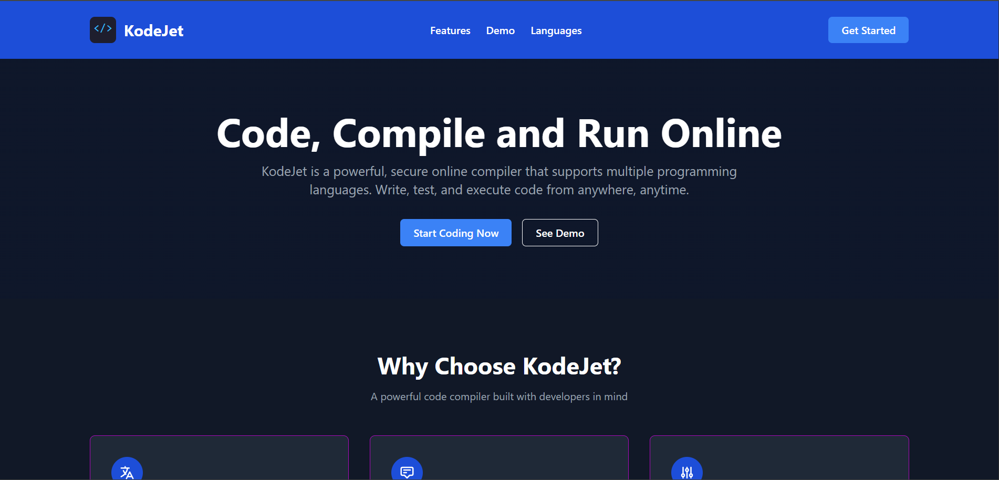
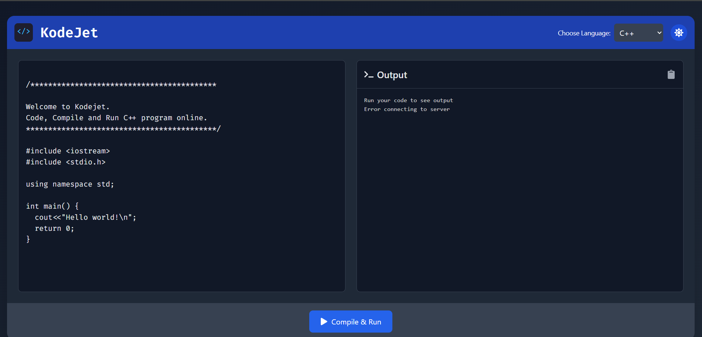

# 🚀 KodeJet - v2

KodeJet v2 is a powerful, secure online compiler that supports multiple programming languages. This version introduces enhanced scalability and performance improvements, making it more robust and efficient. It allows users to write, test, and execute code from anywhere, anytime. This project showcases my skills in full-stack development, including backend, frontend, and DevOps.

## 🌟 Features

- **Multi-language Support**: Compile and run code in C, C++, Java, Python, and JavaScript.
- **Real-time Output**: Get comprehensive execution results including compile errors, runtime output, and execution time.
- **User-friendly Interface**: A clean and intuitive UI built with React and Tailwind CSS.
- **Dark Mode**: Toggle between light and dark themes for a better coding experience.
- **Dockerized**: Fully containerized using Docker for easy deployment and scalability.
- **Scalable Job Queue**: Utilizes Redis and BullMQ for efficient job queue management.

## 🛠️ Technologies Used

### Frontend
- **React**: For building the user interface.
- **TypeScript**: For type safety and better developer experience.
- **Vite**: For fast and optimized builds.
- **Tailwind CSS**: For styling the application.
- **React Router**: For client-side routing.
- **Axios**: For making HTTP requests.
- **React Hot Toast**: For notifications.

### Backend
- **Node.js**: For the server-side runtime.
- **Express**: For building the RESTful API.
- **MongoDB**: For storing job data.
- **Mongoose**: For MongoDB object modeling.
- **BullMQ**: For job queue management.
- **ioredis**: For Redis connection.
- **Docker**: For containerization.

### DevOps
- **Docker Compose**: For orchestrating multi-container Docker applications.
- **Nodemon**: For hot-reloading during development.
- **Concurrently**: For running multiple npm scripts concurrently.

## 🚀 Getting Started

### Prerequisites
- Node.js
- Docker
- Docker Compose

### Installation

1. Clone the repository:

```bash
git clone url
cd KodeJet-v2
```

2. Install server dependencies:
```bash
cd server
npm install
```

3. Install client dependencies:
```bash
cd .. 
cd client
npm install
```

4. Create a `.env` file in the `server` directory and add the following environment variables:
   ```env
   MONGO_URI=mongodb://mongo:27017/kodejet-v2
   REDIS_HOST=redis
   REDIS_PORT=6379
   ```

### Docker Setup

#### Backend

1. Navigate to the `server` directory:
   ```sh
   cd server
   ```

2. Build and run the Docker container:
   ```sh
   docker build -t kodejet-backend .
   docker run -p 3000:3000 -e MONGO_URI=mongodb://mongo:27017/kodejet-v2 -e REDIS_HOST=redis -e REDIS_PORT=6379 kodejet-backend
   ```

#### Frontend

1. Navigate to the `client` directory:
   ```sh
   cd client
   ```

2. Build and run the Docker container:
   ```sh
   docker build -t kodejet-frontend .
   docker run -p 5173:5173 kodejet-frontend
   ```

### Docker Compose Setup

1. Start the application using Docker Compose:
   ```sh
   docker-compose up --build
   ```

2. Open your browser and navigate to `http://localhost:5173` to access the frontend.

## 💻 Usage

1. Navigate to the Playground page.
2. Select a programming language from the dropdown.
3. Write your code in the editor.
4. Click the "Compile & Run" button to execute the code.
5. View the output and job details in the output section.

## 📸 Screenshots




## 🤝 Contributing

Contributions are welcome! Please fork the repository and create a pull request with your changes.

---

Thank you for checking out KodeJet! I hope this project demonstrates my skills and passion for software development. Feel free to reach out if you have any questions or opportunities.
